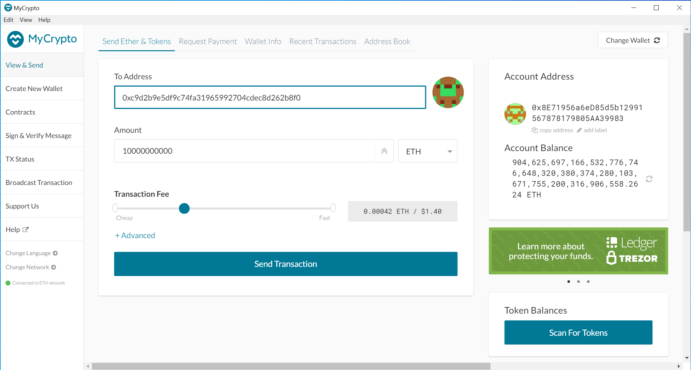

# Proof of Authority Development Chain

Proof-of-Authority is a replacement for Proof-of-Work, which can be used for private chain setups. It does not depend on nodes solving arbitrarily difficult mathematical problems, but instead uses a set of “authorities” - nodes that are explicitly allowed to create new blocks and secure the blockchain.

## Environment setup instructions and dependencies

1. Install [MyCrypto](https://download.mycrypto.com/) Desktop App to interact directly with the blockchain.

2. Install [Go Ethereum Tools](https://geth.ethereum.org/downloads/) to create an Ethereum based blockchain.

## Blockchain setup

1. Create accounts for two nodes for the network and assign a password for each (i.e. 123)
> geth --datadir node1 account new
>
> geth --datadir node2 account new

This makes two keystore files for you with the following pattern:
- node1\keystore\UTC--2021-09-19T16-17-56.424347600Z--8e71956a6ed85d5b12991567878179805aa39983" 

2. Generate the genesis block.
> puppeth
> 

- Then name the network (i.e. alinet)
- Select "Configure new gensis" (i.e. '2')
- Select "Create new genesis from scratch" (i.e. '1')
- Select "Clique - proof-of-authority" (i.e. '2')
- Enter how many seconds should blocks take? (I put 3)

- Paste both account addresses from the first step one at a time into the list of accounts to seal.
- Paste them again in the list of accounts to pre-fund. There are no block rewards in PoA, so you'll need to pre-fund.
- For pre-funding the pre-compiled accounts (0x1 .. 0xff) with wei, put 'no' to keeps the genesis cleaner.
- Put the chain/network ID. (*i.e. 1111)
- Select 'Manage existing genesis' (i.e. '2')
- Select 'Export genesis configurations' to create a JSON file containing your network information. (i.e. '2')
- Hit Enter to create files in the current folder, and then Ctrl+C to exit.

- Now initialize the nodes with the genesis' json file.
> geth --datadir node1 init alinet.json
>
> geth --datadir node2 init alinet.json
>

- Now the nodes can be used to begin mining blocks. Run the nodes in separate terminal windows with the commands:
> geth --datadir node1 --unlock "SEALER_ONE_ADDRESS" --mine --rpc --allow-insecure-unlock
>
> geth --datadir node2 --unlock "SEALER_TWO_ADDRESS" --mine --port 30304 --bootnodes "enode://SEALER_ONE_ENODE_ADDRESS@127.0.0.1:30303" --ipcdisable --allow-insecure-unlock
>

- By running the first command you'll see the screenshot bellow. Take the 'enode' address and pass it to the next command above.

* Commands I ran in my case:
> geth --datadir node1 --unlock "8e71956a6ed85d5b12991567878179805aa39983" --mine --rpc --allow-insecure-unlock
>
> geth --datadir node2 --unlock "c9d2b9e5df9c74fa31965992704cdec8d262b8f0" --mine --port 30304 --bootnodes "enode://a0bbab9a9720feafbece59eb352d356856faff1ec11092ba5db367a37f9059b45b600b13892c1ffecef9d7a7ad506ef9c55bc3f442752e8c431a90f597eba6f8@127.0.0.1:30303" --ipcdisable --allow-insecure-unlock
>

- Flag descriptions:
> ***--mine:*** Enables mining
>
> ***--rpc:*** Enables the HTTP-RPC server
>
> ***--allow-insecure-unlock:*** Allow insecure account unlocking when account-related RPCs are exposed by http
>
> ***--datadir:*** Data directory for the databases and keystore
>
> ***--unlock:*** Comma separated list of accounts to unlock
>
> ***--ipcdisable:*** Disable the IPC-RPC server

- This is how your private PoA blockchain looks like when you make it running:

---
## MyCrypto setup
- Run MyCrypto and hit 'Change network', and then select 'Add Custom Node'.

- Put your network configs running on your localhost.
- Type ETH in the Currency box.
- In the Chain ID box, type the chain id you generated during genesis creation. (i.e. 1111)
- In the URL box type: http://127.0.0.1:8545. This points to the default RPC port on your local machine.
- Finally, click 'Save & Use Custom Node'.

##  Sending money between accounts

- Import the keystore file from the node1/keystore directory into MyCrypto. This will import the private key.

- Locate to the folder where you placed your node1 private key and then import the file.

- Put your password which you protected your private key with (i.e. 123)
- Now yu'll see the account information and the balance.

- Send a transaction from the node1 account to the node2 account.

- You'll immediately se the transactiion details in the console.

- Click the 'Check TX Status' when the green message pops up, confirm the logout:

## Send and receive multi-node test transactions
- Create node3 using the folowing code
> geth --datadir node3 account new
> 
> geth --datadir node3 init alinet.json
> 

- Sending from node1 to node3

- Sending from node1 to itself

- Sending from node2 to itself

